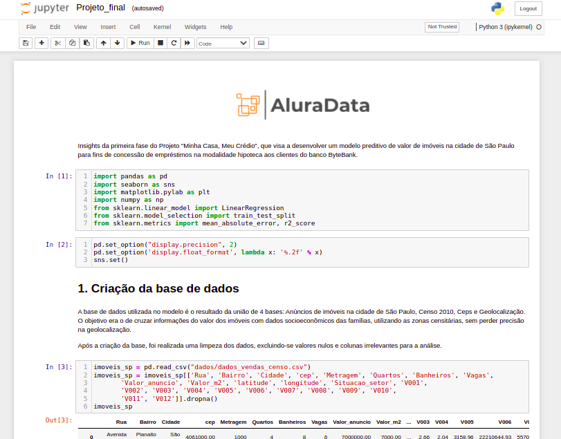

# Imersão de Dados da Alura

Por meio de dados de um projeto fictício, durante a Imersão de Dados da Alura foi ensinado a tratar dados e fazer as primeiras análises estatísticas, como descritivas, além de visualização.

